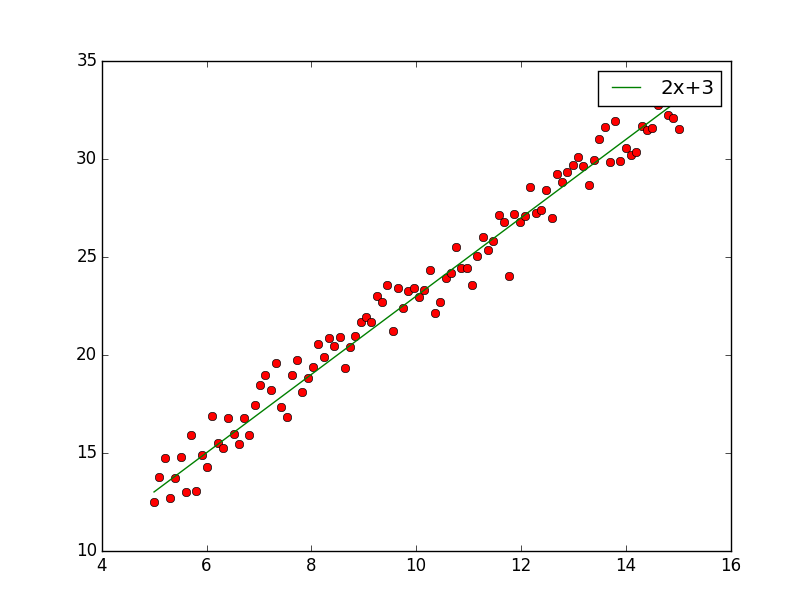
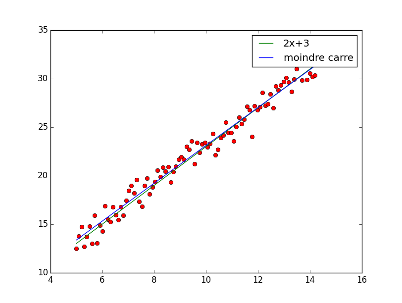

Adrien Agez  
Tristan Camus

# Fondements de l'apprentissage automatique

## TP1 - Introduction 

### Lancement

    python2 plot.py

L'execution provoque l'affichage dans la console des différentes mesures de performance (`J(theta)`), ainsi que l'apparition d'un graphique sur lequel figure en rouge les données d'entrée et en vert la courbe d'approximation `2x + 3` (theta1 = 2, theta2 = 3)

Voici les différentes mesures de performance calculées : 

* jlabs = 0.73987984094  
* jl1 = 0.0896787983772
* jl2 = 0.804228687838
* jlinfini = 2.51624302238

## TP2 - Moindres carrés

### Lancement

    python2 plot.py

On reprend les mêmes données que pour le TP1, mais cette fois ci, l'estimation est calculée par la méthode des moindres carrés. L'execution affiche de nouveau la mesure de performance du TP1 puis affiche les performances obtenues par les moindres carrés, et affiche enfin tous les résultats sur un graphique

theta1 = 1.952, theta2 = 3.596

Par les moindres carrés, les performances sont légèrement différentes

jlabs = 0.73987984094
jl1 = 0.0896787983772
jl2 = 0.804228687838
jlinfini = 2.51624302238

### Interprétation des résultats 

TODO

## TP3 - Descente de gradient

    python2 plot.py

theta1 = 1.958, theta2 = 3.538

* jlabs = 0.728262420172
* jl1 = 0.0877426597612
* jl2 = 0.769877434196
* jlinfini = 2.56355820742

Mesure | TP1 | Moindres carrés | Descente de gradient
-------|-----|-----------------|-------------------------
theta1 | 2 | 1.952 | 1.958
theta2 | 3 | 3.596 | 3.538
jlabs | 0.73987984094 | 0.727356264922 | 0.728262420172
jl1 | 0.0896787983772 | 0.0877279862436 | 0.0877426597612
jl2 | 0.804228687838 | 0.769619957035 | 0.769877434196
jlinfini | 2.51624302238 | 2.55866627298 | 2.56355820742