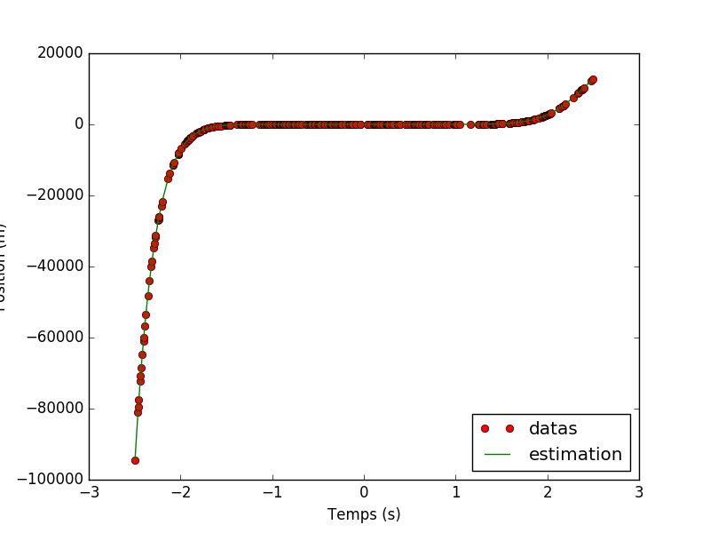

Adrien Agez  
Tristan Camus

# Fondements de l'apprentissage automatique

## TP1 - Introduction 

### Lancement

    python2 plot.py

L'execution provoque l'affichage dans la console des différentes mesures de performance (`J(theta)`), ainsi que l'apparition d'un graphique sur lequel figure en rouge les données d'entrée et en vert la courbe d'approximation `y = 2x + 3` (theta1 = 2, theta2 = 3)

Voici les différentes mesures de performance calculées : 

* jlabs = 0.73987984094  
* jl1 = 0.0896787983772
* jl2 = 0.804228687838
* jlinfini = 2.51624302238

## TP2 - Moindres carrés

### Lancement

    python2 plot.py

On reprend les mêmes données que pour le TP1, mais cette fois ci, l'estimation est calculée par la méthode des moindres carrés. L'execution affiche de nouveau la mesure de performance du TP1 puis affiche les performances obtenues par les moindres carrés, et affiche enfin tous les résultats sur un graphique

Cette fois ci, on peut mieux approximer la position en utilisant les moindres carrés. L'estimation `2x + 3` devient1 `1.95293789 * x + 3.59623499`

Par les moindres carrés, les performances sont légèrement différentes

* jlabs = 0.73987984094
* jl1 = 0.0896787983772
* jl2 = 0.804228687838
* jlinfini = 2.51624302238

L'erreur est un peu plus faible que dans le TP1, ce qui prouve que l'approximation est meilleure

### Interprétation des résultats 

La différence entre les données et l'estimation est légèrement plus faible qu'avec l'estimation du TP1

## TP3 - Descente de gradient

    python2 plot.py

Le graphique affiche l'évolution des theta en au fur et à mesure des itérations de la descente de gradient. Le résutlat obtenu est très similaire à celui des moindres carrés

theta1 = 1.95822488, theta2 = 3.53891134

* jlabs = 0.728262420172
* jl1 = 0.0877426597612
* jl2 = 0.769877434196
* jlinfini = 2.56355820742

## Récapitulatif des résultats obtenus avec les différentes méthodes

Mesure | TP1 | Moindres carrés | Descente de gradient
-------|-----|-----------------|-------------------------
theta1 | 2 | 1.952 | 1.958
theta2 | 3 | 3.596 | 3.538
jlabs | 0.73987984094 | 0.727356264922 | 0.728262420172
jl1 | 0.0896787983772 | 0.0877279862436 | 0.0877426597612
jl2 | 0.804228687838 | 0.769619957035 | 0.769877434196
jlinfini | 2.51624302238 | 2.55866627298 | 2.56355820742

# TP4 - Généralisation

    python2 plot.py

Le but de ce TP est de trouver le meilleur polynome pour approximer les données

la figure suivante montre le polynome d'ordre 13 trouvé par le script pour approximer au mieux les données. On peut égalemnt passer en paramètre de la ligne de commande l'ordre du polynome à trouver. Le résultat peut s'en trouver grandement changé

# TP5 - Regression logistique